# Swiggy Data Analysis Using SQL
This project focuses on analyzing Swiggy’s food delivery data using SQL. The goal was to apply advanced SQL queries to extract business insights and support decision-making.

---

### Project Details
This project focuses on analyzing **Swiggy’s food delivery data** using **SQL**. The goal was to apply **advanced SQL queries** to extract business insights and support decision-making.

**🔹 Key Queries & Insights:**
* ✅ Retrieved customers by location (e.g., Delhi, Mumbai) for region-specific strategies
* ✅ Calculated average restaurant ratings for quality assessment
* ✅ Analyzed customer order frequency (active vs inactive customers)
* ✅ Identified top-performing restaurants by revenue & ratings
* ✅ Displayed orders in the last 30 days for trend analysis
* ✅ Evaluated delivery partner performance (most active, highest customer coverage)
* ✅ Detected customers with similar patterns (same restaurant, same city, different dates)

**💡 Outcome:**
The project helped simulate **real-world food delivery analytics**, providing insights into customer behavior, restaurant performance, and delivery partner efficiency.

**🔗 Skills Used:** Advanced SQL (Joins, Aggregations, Subqueries, Group By, Date Functions)

---

### 📂 Project Files
* **[📊 View All 13 Analysis Queries](analysis_queries.sql)**
* **[🗂️ Download Dataset (rar)](dataset.rar)**

---

### 📈 SQL Analysis Queries
Here are the 13 queries and screenshots from the project.

**1. Display all the customers who live in Delhi.**
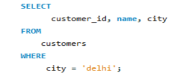

**2. Find the average rating of all the restaurants in Mumbai.**
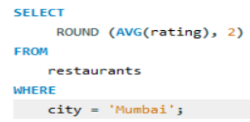

**3. List all the customers who have placed at least one order.**
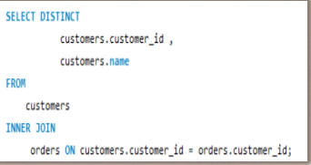

**4. Display the total number of orders placed by each customer.**
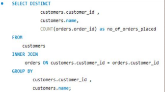

**5. Find the total revenue generated by each restaurant.**
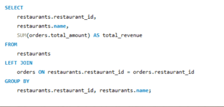

**6. Find the top 5 restaurants with the highest average rating.**
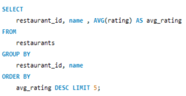

**7. Display all customers who have never placed an order.**
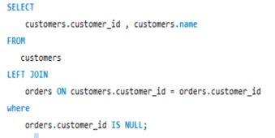

**8. Find the number of orders placed by each customer in 'Mumbai'.**
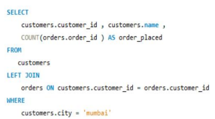

**9. Display all the orders placed in last 30 days.**
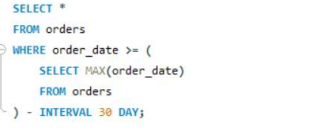

**10. List all delivery partners who have completed more than 1 delivery.**
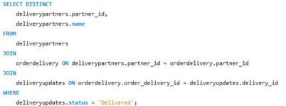

**11. Find the customers who have placed orders on exactly 3 different days.**
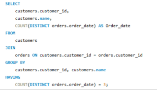

**12. Find the delivery partner who has worked with the most different customers.**
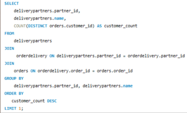

**13. Identify customers who have the same city and have placed orders at the same restaurants.**
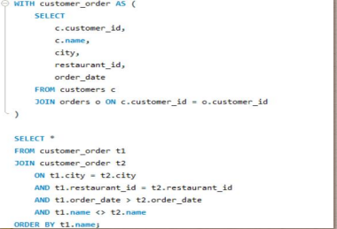

---

## 🏁 Conclusion
This SQL analysis project successfully demonstrated the ability to query a complex database to extract actionable business insights. By analyzing customer behavior, restaurant performance, and delivery logistics, this project showcases a strong foundation in real-world data analytics and advanced SQL.
