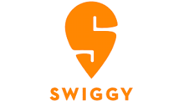

# Swiggy Data Analysis Using SQL
This project focuses on analyzing Swiggy’s food delivery data using SQL. The goal was to apply advanced SQL queries to extract business insights and support decision-making.

---

### Project Details
This project focuses on analyzing **Swiggy’s food delivery data** using **SQL**. The goal was to apply **advanced SQL queries** to extract business insights and support decision-making.

**🔹 Key Queries & Insights:**
* ✅ Retrieved customers by location (e.g., Delhi, Mumbai) for region-specific strategies
* ✅ Calculated average restaurant ratings for quality assessment
* ✅ Analyzed customer order frequency (active vs inactive customers)
* ✅ Identified top-performing restaurants by revenue & ratings
* ✅ Displayed orders in the last 30 days for trend analysis
* ✅ Evaluated delivery partner performance (most active, highest customer coverage)
* ✅ Detected customers with similar patterns (same restaurant, same city, different dates)

**💡 Outcome:**
The project helped simulate **real-world food delivery analytics**, providing insights into customer behavior, restaurant performance, and delivery partner efficiency.

**🔗 Skills Used:** Advanced SQL (Joins, Aggregations, Subqueries, Group By, Date Functions)

---

### <b>&#128_187;</b> Project Files
* **[📊 View All 13 Analysis Queries](analysis_queries.sql)**
* **[🗂️ Download Dataset (rar)](dataset.rar)**
